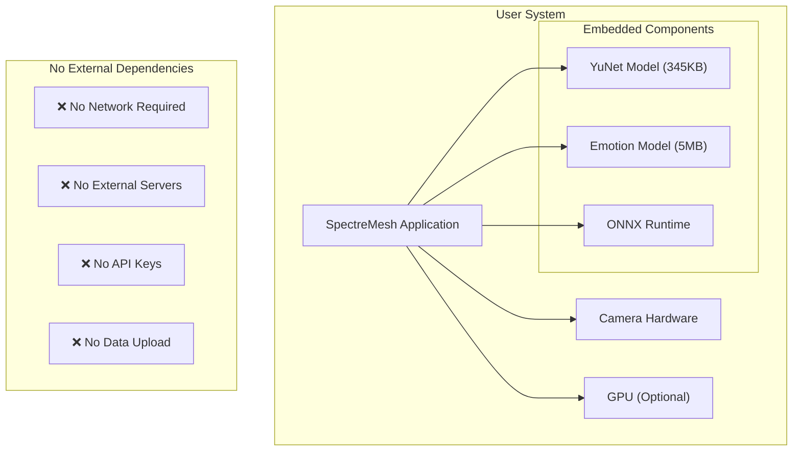
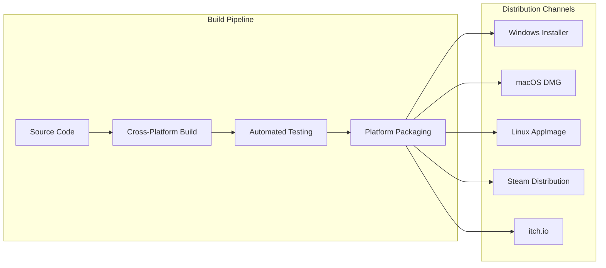

# SpectreMesh Deployment Guide

**Production deployment instructions for cross-platform emotion-responsive horror**

## Table of Contents

- [Deployment Overview](#deployment-overview)
- [Platform-Specific Setup](#platform-specific-setup)
- [Build Configuration](#build-configuration)
- [Distribution Strategy](#distribution-strategy)
- [Performance Optimization](#performance-optimization)
- [Troubleshooting](#troubleshooting)
- [Monitoring & Maintenance](#monitoring--maintenance)

## Deployment Overview

SpectreMesh is designed for **local deployment** with no external dependencies or network requirements. All emotion processing happens on-device for privacy and performance.

### Deployment Architecture



### System Requirements

| Component | Minimum | Recommended | Notes |
|-----------|---------|-------------|-------|
| **CPU** | Intel i5-4590 / AMD FX 8350 | Intel i7-8700K / AMD Ryzen 5 3600 | Real-time processing |
| **Memory** | 4GB RAM | 8GB RAM | ONNX Runtime + models |
| **GPU** | Integrated graphics | GTX 1050 / RX 560 | Optional acceleration |
| **Camera** | 720p webcam | 1080p webcam | Face detection quality |
| **Storage** | 500MB available | 1GB available | Application + assets |
| **OS** | Windows 10 / macOS 10.14 / Ubuntu 18.04 | Latest versions | Platform compatibility |

## Platform-Specific Setup

### Windows Deployment

#### Prerequisites
```powershell
# Install Visual C++ Redistributable (required for ONNX Runtime)
# Download from Microsoft: vc_redist.x64.exe

# Verify camera access
# Settings > Privacy > Camera > Allow apps to access camera
```

#### Build Configuration
```toml
# Cargo.toml - Windows-specific optimizations
[target.'cfg(windows)'.dependencies]
opencv = { version = "0.94", features = ["opencv-4"] }

[profile.release]
lto = true
codegen-units = 1
panic = "abort"
strip = true
```

#### Distribution Package
```
spectremesh-windows/
├── spectremesh.exe          # Main application
├── opencv_world4xx.dll      # OpenCV runtime
├── onnxruntime.dll          # ONNX Runtime
├── assets/                  # Game assets
└── README.txt               # Setup instructions
```

#### Installation Script
```batch
@echo off
echo Installing SpectreMesh...

REM Check camera permissions
echo Checking camera access...
powershell -Command "Get-WmiObject Win32_PnPEntity | Where-Object {$_.Name -like '*camera*'}"

REM Install Visual C++ Redistributable if needed
if not exist "%ProgramFiles%\Microsoft Visual Studio\2019\BuildTools" (
    echo Installing Visual C++ Redistributable...
    vc_redist.x64.exe /quiet
)

REM Copy files to Program Files
xcopy /E /I . "%ProgramFiles%\SpectreMesh\"

echo Installation complete!
echo Run spectremesh.exe to start the game.
pause
```

### macOS Deployment

#### Prerequisites
```bash
# Verify camera permissions
# System Preferences > Security & Privacy > Camera

# Check for required frameworks
ls /System/Library/Frameworks/AVFoundation.framework
ls /System/Library/Frameworks/CoreMedia.framework
```

#### Build Configuration
```toml
# Cargo.toml - macOS-specific optimizations
[target.'cfg(target_os = "macos")'.dependencies]
opencv = { version = "0.94", features = ["opencv-4"] }

[profile.release]
lto = true
strip = true
```

#### App Bundle Structure
```
SpectreMesh.app/
├── Contents/
│   ├── Info.plist           # App metadata
│   ├── MacOS/
│   │   └── spectremesh      # Main executable
│   ├── Resources/
│   │   └── assets/          # Game assets
│   └── Frameworks/          # Bundled libraries
│       ├── libopencv_core.dylib
│       └── libonnxruntime.dylib
```

#### Info.plist Configuration
```xml
<?xml version="1.0" encoding="UTF-8"?>
<plist version="1.0">
<dict>
    <key>CFBundleName</key>
    <string>SpectreMesh</string>
    <key>CFBundleVersion</key>
    <string>1.0.0</string>
    <key>NSCameraUsageDescription</key>
    <string>SpectreMesh uses your camera for real-time emotion detection to create responsive horror experiences.</string>
    <key>LSMinimumSystemVersion</key>
    <string>10.14</string>
</dict>
</plist>
```

#### Code Signing
```bash
# Sign the application for distribution
codesign --force --verify --verbose --sign "Developer ID Application: Your Name" SpectreMesh.app

# Create DMG for distribution
hdiutil create -volname "SpectreMesh" -srcfolder SpectreMesh.app -ov -format UDZO SpectreMesh.dmg
```

### Linux Deployment

#### Prerequisites
```bash
# Ubuntu/Debian
sudo apt update
sudo apt install libopencv-dev libonnxruntime-dev

# Fedora/RHEL
sudo dnf install opencv-devel onnxruntime-devel

# Arch Linux
sudo pacman -S opencv onnxruntime
```

#### Build Configuration
```toml
# Cargo.toml - Linux-specific optimizations
[target.'cfg(target_os = "linux")'.dependencies]
opencv = { version = "0.94", features = ["opencv-4"] }

[profile.release]
lto = true
strip = true
```

#### AppImage Distribution
```bash
# Create AppImage for universal Linux distribution
wget https://github.com/AppImage/AppImageKit/releases/download/continuous/appimagetool-x86_64.AppImage
chmod +x appimagetool-x86_64.AppImage

# Create AppDir structure
mkdir -p SpectreMesh.AppDir/usr/bin
mkdir -p SpectreMesh.AppDir/usr/lib
mkdir -p SpectreMesh.AppDir/usr/share/applications

# Copy application
cp target/release/spectremesh SpectreMesh.AppDir/usr/bin/
cp -r assets SpectreMesh.AppDir/usr/share/

# Create desktop file
cat > SpectreMesh.AppDir/spectremesh.desktop << EOF
[Desktop Entry]
Type=Application
Name=SpectreMesh
Exec=spectremesh
Icon=spectremesh
Categories=Game;
EOF

# Build AppImage
./appimagetool-x86_64.AppImage SpectreMesh.AppDir SpectreMesh-x86_64.AppImage
```

## Build Configuration

### Release Optimization

```toml
[profile.release]
# Maximum optimization for production
opt-level = 3
lto = true
codegen-units = 1
panic = "abort"
strip = true

# Platform-specific optimizations
[target.'cfg(target_arch = "x86_64")'.rustflags]
rustflags = ["-C", "target-cpu=native"]
```

### Feature Configuration

```toml
[features]
default = ["embedded-models", "gpu-acceleration"]

# Embed ML models in binary (recommended for distribution)
embedded-models = []

# Enable GPU acceleration where available
gpu-acceleration = ["onnxruntime/cuda", "opencv/cuda"]

# Development features
mock-sensor = []
debug-ui = ["bevy/debug"]
performance-metrics = []
```

### Cross-Compilation

```bash
# Windows from Linux
rustup target add x86_64-pc-windows-gnu
cargo build --release --target x86_64-pc-windows-gnu

# macOS from Linux (requires osxcross)
rustup target add x86_64-apple-darwin
cargo build --release --target x86_64-apple-darwin

# Linux ARM64 (for Raspberry Pi, etc.)
rustup target add aarch64-unknown-linux-gnu
cargo build --release --target aarch64-unknown-linux-gnu
```

## Distribution Strategy

### Binary Distribution



### Packaging Scripts

```bash
#!/bin/bash
# build-all-platforms.sh

set -e

echo "Building SpectreMesh for all platforms..."

# Clean previous builds
cargo clean

# Build for each platform
platforms=("x86_64-pc-windows-gnu" "x86_64-apple-darwin" "x86_64-unknown-linux-gnu")

for platform in "${platforms[@]}"; do
    echo "Building for $platform..."
    cargo build --release --target $platform
    
    # Run tests if building for current platform
    if [[ "$platform" == "$(rustc -vV | grep host | cut -d' ' -f2)" ]]; then
        cargo test --release --target $platform
    fi
done

echo "Creating distribution packages..."
./scripts/package-windows.sh
./scripts/package-macos.sh
./scripts/package-linux.sh

echo "Build complete!"
```

### Automated Testing

```yaml
# .github/workflows/release.yml
name: Release Build

on:
  push:
    tags: ['v*']

jobs:
  build:
    strategy:
      matrix:
        os: [ubuntu-latest, windows-latest, macos-latest]
    
    runs-on: ${{ matrix.os }}
    
    steps:
    - uses: actions/checkout@v3
    
    - name: Install Rust
      uses: actions-rs/toolchain@v1
      with:
        toolchain: stable
        override: true
    
    - name: Install dependencies (Ubuntu)
      if: matrix.os == 'ubuntu-latest'
      run: sudo apt-get install libopencv-dev
    
    - name: Install dependencies (macOS)
      if: matrix.os == 'macos-latest'
      run: brew install opencv
    
    - name: Build release
      run: cargo build --release
    
    - name: Run tests
      run: cargo test --release
    
    - name: Package application
      run: ./scripts/package-${{ matrix.os }}.sh
    
    - name: Upload artifacts
      uses: actions/upload-artifact@v3
      with:
        name: spectremesh-${{ matrix.os }}
        path: dist/
```

## Performance Optimization

### Runtime Optimization

```rust
// Performance-critical configuration
pub fn optimized_config() -> SensorConfig {
    SensorConfig {
        onnx_threads: num_cpus::get().min(4), // Optimal thread count
        target_fps: 30.0,                     // Balanced performance
        channel_buffer_size: 2,               // Minimal latency
        ..Default::default()
    }
}

// GPU acceleration when available
#[cfg(feature = "gpu-acceleration")]
pub fn gpu_config() -> SensorConfig {
    let mut config = optimized_config();
    config.use_gpu = true;
    config.gpu_device_id = 0;
    config
}
```

### Memory Management

```rust
// Pre-allocate buffers for zero-copy processing
pub struct OptimizedSensor {
    frame_buffer: Vec<u8>,
    face_crop_buffer: Vec<u8>,
    tensor_buffer: Vec<f32>,
}

impl OptimizedSensor {
    pub fn new() -> Self {
        Self {
            frame_buffer: vec![0; 1920 * 1080 * 3], // Max frame size
            face_crop_buffer: vec![0; 48 * 48],      // Face crop size
            tensor_buffer: vec![0.0; 48 * 48],       // ONNX input tensor
        }
    }
}
```

### Profiling Integration

```bash
# Performance profiling in production
cargo install flamegraph
cargo flamegraph --bin spectremesh --release

# Memory profiling
cargo install heaptrack
heaptrack target/release/spectremesh

# CPU profiling
perf record -g target/release/spectremesh
perf report
```

## Troubleshooting

### Common Deployment Issues

#### Camera Access Problems
```bash
# Windows: Check privacy settings
# Settings > Privacy > Camera > Allow apps to access camera

# macOS: Check permissions
# System Preferences > Security & Privacy > Camera

# Linux: Check user groups
groups | grep video
sudo usermod -a -G video $USER
```

#### Missing Dependencies
```bash
# Windows: Install Visual C++ Redistributable
# Download from Microsoft official site

# macOS: Install Xcode Command Line Tools
xcode-select --install

# Linux: Install OpenCV development packages
sudo apt install libopencv-dev  # Ubuntu/Debian
sudo dnf install opencv-devel   # Fedora/RHEL
```

#### Performance Issues
```bash
# Check system resources
htop  # Linux/macOS
taskmgr  # Windows

# Verify GPU acceleration
nvidia-smi  # NVIDIA GPUs
rocm-smi   # AMD GPUs

# Test with mock sensor to isolate camera issues
./spectremesh --mock
```

### Diagnostic Tools

```rust
// Built-in diagnostics
pub fn run_diagnostics() -> DiagnosticReport {
    DiagnosticReport {
        platform: env::consts::OS,
        camera_count: enumerate_cameras().len(),
        opencv_version: opencv::core::CV_VERSION,
        onnx_version: onnxruntime::version(),
        memory_usage: get_memory_usage(),
        gpu_available: check_gpu_acceleration(),
    }
}
```

## Monitoring & Maintenance

### Health Checks

```rust
// Application health monitoring
pub struct HealthMonitor {
    last_frame_time: Instant,
    frame_count: u64,
    error_count: u64,
}

impl HealthMonitor {
    pub fn check_health(&self) -> HealthStatus {
        let fps = self.calculate_fps();
        let error_rate = self.calculate_error_rate();
        
        if fps < 20.0 || error_rate > 0.1 {
            HealthStatus::Degraded
        } else if fps < 25.0 || error_rate > 0.05 {
            HealthStatus::Warning
        } else {
            HealthStatus::Healthy
        }
    }
}
```

### Logging Configuration

```rust
// Production logging setup
use tracing::{info, warn, error};
use tracing_subscriber::{layer::SubscriberExt, util::SubscriberInitExt};

pub fn setup_logging() {
    tracing_subscriber::registry()
        .with(tracing_subscriber::EnvFilter::new("spectremesh=info"))
        .with(tracing_subscriber::fmt::layer())
        .init();
}
```

### Update Strategy

```bash
# Automatic update checking
curl -s https://api.github.com/repos/spectremesh/spectremesh/releases/latest \
  | grep "tag_name" \
  | cut -d '"' -f 4

# In-place update (Linux/macOS)
wget https://github.com/spectremesh/spectremesh/releases/latest/download/spectremesh-linux.tar.gz
tar -xzf spectremesh-linux.tar.gz
./install.sh
```

This deployment guide ensures reliable, cross-platform distribution of SpectreMesh while maintaining optimal performance and user experience across Windows, macOS, and Linux systems.
