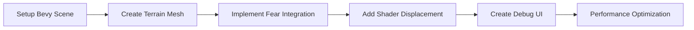
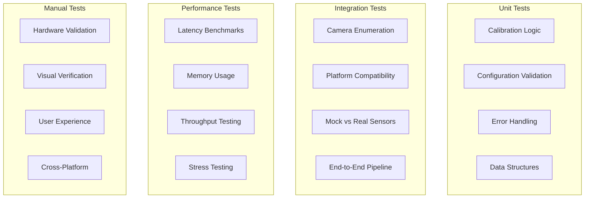

# SpectreMesh Development Guide

**Complete setup and contribution guide for emotion-responsive procedural horror**

## Table of Contents

- [Quick Start](#quick-start)
- [Development Environment](#development-environment)
- [Project Structure](#project-structure)
- [Development Workflow](#development-workflow)
- [Testing Strategy](#testing-strategy)
- [Contributing Guidelines](#contributing-guidelines)
- [Troubleshooting](#troubleshooting)

## Quick Start

### Prerequisites

```bash
# Install Rust (1.70+ required)
curl --proto '=https' --tlsv1.2 -sSf https://sh.rustup.rs | sh
source ~/.cargo/env

# Platform-specific dependencies
# Ubuntu/Debian:
sudo apt update
sudo apt install libopencv-dev libclang-dev pkg-config build-essential

# macOS:
brew install opencv pkg-config

# Windows:
# Install Visual Studio Build Tools
# Install OpenCV via vcpkg or download pre-built binaries
```

### Initial Setup

```bash
# Clone the repository
git clone https://github.com/JtPerez-Acle/Spectremesh
cd spectremesh

# Build the project
cargo build

# Run tests to verify setup
cargo test

# Test camera functionality
cargo run --bin spectreprobe --mock  # No camera required
cargo run --bin spectreprobe          # Real camera test
```

### Verify Installation

```bash
# Expected output from spectreprobe --mock:
✅ Found 1 camera(s): Mock Camera
✅ Fear detection pipeline functional
✅ Calibration system working
✅ Platform-specific configuration working
```

## Development Environment

### Recommended Tools

- **IDE**: VS Code with rust-analyzer extension
- **Debugger**: CodeLLDB for VS Code
- **Profiling**: `cargo flamegraph` for performance analysis
- **Documentation**: `cargo doc --open` for API docs

### VS Code Configuration

Create `.vscode/settings.json`:
```json
{
    "rust-analyzer.cargo.features": ["all"],
    "rust-analyzer.checkOnSave.command": "clippy",
    "rust-analyzer.cargo.loadOutDirsFromCheck": true,
    "files.watcherExclude": {
        "**/target/**": true
    }
}
```

Create `.vscode/launch.json` for debugging:
```json
{
    "version": "0.2.0",
    "configurations": [
        {
            "type": "lldb",
            "request": "launch",
            "name": "Debug spectreprobe",
            "cargo": {
                "args": ["build", "--bin=spectreprobe"],
                "filter": {
                    "name": "spectreprobe",
                    "kind": "bin"
                }
            },
            "args": ["--mock"],
            "cwd": "${workspaceFolder}"
        }
    ]
}
```

## Project Structure

### Crate Organization

```
spectremesh/
├── Cargo.toml              # Workspace configuration
├── README.md               # Project overview
├── docs/                   # Documentation
│   ├── TECHNICAL_ARCHITECTURE.md
│   ├── DEVELOPMENT_GUIDE.md
│   ├── API_REFERENCE.md
│   └── DEPLOYMENT_GUIDE.md
├── spectre_sensor/         # 🔒 COMPLETE - Fear detection engine
│   ├── src/
│   │   ├── lib.rs          # Public API exports
│   │   ├── sensor.rs       # Core EmotionSensor implementation
│   │   ├── yunet.rs        # YuNet face detection
│   │   ├── calibrator.rs   # Adaptive calibration system
│   │   ├── compat.rs       # Legacy API compatibility
│   │   ├── config.rs       # Configuration management
│   │   ├── permissions.rs  # Platform-specific permissions
│   │   └── types.rs        # Core data structures
│   ├── tests/              # Integration tests
│   └── models/             # Embedded ML models
├── crates/
│   ├── core/               # 🔒 STABLE - Shared types and traits
│   │   ├── src/
│   │   │   ├── types.rs    # FearScore, CameraDevice, etc.
│   │   │   ├── config.rs   # Configuration structures
│   │   │   └── error.rs    # Error types and handling
│   ├── game/               # 🚧 ACTIVE DEVELOPMENT - Bevy application
│   │   ├── src/
│   │   │   ├── lib.rs      # Game plugin and systems
│   │   │   ├── resources.rs # ECS resources
│   │   │   ├── systems.rs  # Game systems
│   │   │   └── bin/
│   │   │       └── spectreprobe.rs # Hardware validation utility
│   │   └── main.rs         # Game entry point
│   └── terrain/            # 🔮 FUTURE - Procedural terrain generation
└── assets/                 # Game assets (models, textures, etc.)
```

### Module Responsibilities

| Module | Status | Purpose | Modification Policy |
|--------|--------|---------|-------------------|
| `spectre_sensor/` | 🔒 **Complete** | Fear detection engine | **DO NOT MODIFY** |
| `crates/core/` | 🔒 **Stable** | Shared types and interfaces | Minimal changes only |
| `crates/game/` | 🚧 **Active** | Bevy game application | **Primary development target** |
| `crates/terrain/` | 🔮 **Future** | Terrain generation | M0.5+ development |

## Development Workflow

### Current Focus: M0.5 (Shader-Warp)

The primary development target is implementing visual proof of concept using Bevy 0.16:

#### M0.5 Success Criteria
1. **3D Scene**: Basic Bevy app with camera controls and terrain mesh
2. **Fear Integration**: Real-time terrain displacement based on fear input
3. **Debug UI**: Manual fear slider for testing without camera
4. **Performance**: Smooth 60 FPS with real-time updates

#### Development Steps



### Working with Fear Detection

```rust
// Use the existing fear detection system
use spectre_sensor::compat::{FearSensor, MockFearSensor, YuNetFearSensor};
use spectremesh_core::FearScore;

// For development (no camera required)
let mut sensor = MockFearSensor::step_pattern();

// For production (real hardware)
// let mut sensor = YuNetFearSensor::new();

// Initialize and start
sensor.initialize(&config).await?;
let receiver = sensor.start().await?;

// Receive fear scores in your game loop
while let Ok(fear_score) = receiver.recv().await {
    // Use fear_score.value [0.0, 1.0] to modify terrain
    update_terrain_displacement(fear_score.value);
}
```

### Bevy Integration Pattern

```rust
use bevy::prelude::*;
use spectremesh_core::FearScore;

#[derive(Resource)]
pub struct FearState {
    pub current_fear: f32,
    pub receiver: Option<Receiver<FearScore>>,
    pub terrain_needs_update: bool,
}

fn update_fear_system(
    mut fear_state: ResMut<FearState>,
    mut terrain_query: Query<&mut Transform, With<TerrainMesh>>,
) {
    if let Some(receiver) = &fear_state.receiver {
        if let Ok(fear_score) = receiver.try_recv() {
            fear_state.current_fear = fear_score.value;
            fear_state.terrain_needs_update = true;
        }
    }
}

fn update_terrain_system(
    mut fear_state: ResMut<FearState>,
    mut terrain_query: Query<&mut Transform, With<TerrainMesh>>,
) {
    if fear_state.terrain_needs_update {
        for mut transform in terrain_query.iter_mut() {
            // Apply fear-based displacement
            let displacement = fear_state.current_fear * 10.0;
            transform.translation.y = displacement;
        }
        fear_state.terrain_needs_update = false;
    }
}
```

## Testing Strategy

### Test Categories



### Running Tests

```bash
# Unit tests (fast, no hardware required)
cargo test -p spectre-sensor
cargo test -p spectremesh-core

# Integration tests (may require camera)
cargo test -p spectremesh --bin spectreprobe

# All tests
cargo test --workspace

# Performance benchmarks
cargo run --bin performance_test --release

# Manual hardware validation
cargo run --bin spectreprobe          # Real camera
cargo run --bin spectreprobe --mock   # Mock sensor
```

### Test Development Guidelines

1. **Mock by Default**: Use `MockFearSensor` for development and CI
2. **Hardware Optional**: Tests should pass without camera hardware
3. **Platform Agnostic**: Tests should work on Windows/macOS/Linux
4. **Performance Aware**: Include latency assertions for critical paths

### Writing New Tests

```rust
#[tokio::test]
async fn test_fear_integration() {
    // Use mock sensor for reliable testing
    let mut sensor = MockFearSensor::step_pattern();
    let config = SensorConfig::default();
    
    sensor.initialize(&config).await.unwrap();
    let receiver = sensor.start().await.unwrap();
    
    // Test fear score reception
    let fear_score = receiver.recv().await.unwrap();
    assert!(fear_score.value >= 0.0 && fear_score.value <= 1.0);
    
    sensor.stop().await.unwrap();
}
```

## Contributing Guidelines

### Code Style

- **Rust Standard**: Follow `rustfmt` and `clippy` recommendations
- **Documentation**: All public APIs must have doc comments
- **Error Handling**: Use `thiserror` for error types, avoid `unwrap()` in production code
- **Async**: Use `tokio` for async operations, avoid blocking in async contexts

### Commit Guidelines

```
feat: add terrain displacement shader system
fix: resolve camera enumeration on Windows
docs: update API reference for FearScore
test: add integration tests for cross-platform compatibility
perf: optimize YuNet face detection pipeline
```

### Pull Request Process

1. **Fork and Branch**: Create feature branch from `main`
2. **Implement**: Follow development guidelines and test thoroughly
3. **Test**: Ensure all tests pass on your platform
4. **Document**: Update relevant documentation
5. **Submit**: Create PR with clear description and test results

### Review Criteria

- ✅ All tests pass
- ✅ Code follows style guidelines
- ✅ Documentation is updated
- ✅ No breaking changes to stable APIs
- ✅ Performance impact is acceptable

## Troubleshooting

### Common Issues

#### Camera Access Problems
```bash
# Linux: Check user permissions
groups | grep video  # Should include 'video' group
sudo usermod -a -G video $USER  # Add user to video group

# macOS: Check camera permissions
# System Preferences > Security & Privacy > Camera

# Windows: Check privacy settings
# Settings > Privacy > Camera
```

#### Build Failures
```bash
# OpenCV not found
export PKG_CONFIG_PATH=/usr/local/lib/pkgconfig:$PKG_CONFIG_PATH

# Linker errors on Windows
# Install Visual Studio Build Tools with C++ support

# macOS compilation issues
xcode-select --install
```

#### Performance Issues
```bash
# Enable optimizations
cargo build --release

# Profile performance
cargo install flamegraph
cargo flamegraph --bin spectreprobe

# Check system resources
htop  # Monitor CPU/memory usage during operation
```

### Getting Help

1. **Check Documentation**: Review API reference and architecture docs
2. **Search Issues**: Look for similar problems in GitHub issues
3. **Run Diagnostics**: Use `spectreprobe` to validate system state
4. **Create Issue**: Provide system info, error logs, and reproduction steps

### Development Tips

- **Start with Mock**: Use `MockFearSensor` for initial development
- **Test Incrementally**: Validate each component before integration
- **Profile Early**: Use `cargo flamegraph` to identify bottlenecks
- **Document Decisions**: Update docs when making architectural changes

This guide provides everything needed to contribute effectively to SpectreMesh development while maintaining the high quality and cross-platform compatibility of the existing codebase.
