# SpectreMesh: Project Approach & Philosophy

**Technical strategy and design philosophy behind emotion-responsive procedural horror**

## Table of Contents

- [Project Vision](#project-vision)
- [Risk-Kill Development Strategy](#risk-kill-development-strategy)
- [Technical Philosophy](#technical-philosophy)
- [Architecture Decisions](#architecture-decisions)
- [Innovation & Research](#innovation--research)
- [Lessons Learned](#lessons-learned)
- [Future Roadmap](#future-roadmap)

## Project Vision

SpectreMesh represents a **convergence of computer vision, game development, and psychological horror** to create truly adaptive entertainment experiences. The project explores how real-time biometric feedback can fundamentally change the relationship between player and game.

### Core Hypothesis

> **"Personalized fear detection can create more engaging horror experiences than traditional static content."**

Traditional horror games rely on **universal fear triggers** (jump scares, darkness, audio cues) that affect different players inconsistently. SpectreMesh hypothesizes that **individualized fear measurement** enables dynamic content adaptation that maintains optimal psychological tension for each player.

### Design Goals


## Risk-Kill Development Strategy

SpectreMesh follows a **risk-kill methodology** where the highest technical risks are addressed first through incremental milestones. This approach ensures project viability before investing in complex game mechanics.

### Risk Assessment Matrix

| Risk Category | Probability | Impact | Mitigation Strategy | Status |
|---------------|-------------|--------|-------------------|---------|
| **Camera Access** | High | Critical | Hardware validation, mock fallback | ✅ **Resolved** |
| **Real-time Performance** | Medium | High | ONNX optimization, embedded models | ✅ **Resolved** |
| **Cross-platform Compatibility** | Medium | High | Platform abstraction, unified APIs | ✅ **Resolved** |
| **Emotion Recognition Accuracy** | Medium | Medium | Calibration system, baseline normalization | ✅ **Resolved** |
| **Privacy Concerns** | Low | High | Local processing, no data transmission | ✅ **Resolved** |
| **Game Integration Complexity** | Low | Medium | Trait-based design, async architecture | 🚧 **In Progress** |

### Success Metrics

Each milestone has **quantifiable success criteria**:

- **M0**: Real hardware integration with <50ms latency
- **M0.2**: ONNX Runtime 2.0 with embedded models
- **Cross-Platform**: Windows/macOS/Linux compatibility
- **M0.5**: 60 FPS terrain displacement with real-time fear input
- **M1**: End-to-end camera → terrain pipeline
- **M2**: Advanced voxel terrain with marching cubes

## Technical Philosophy

### Privacy-First Architecture

SpectreMesh is designed with **privacy as a fundamental requirement**, not an afterthought:

```mermaid
graph TB
    subgraph "Local Processing Only"
        CAM[Camera Input] --> PROC[On-Device Processing]
        PROC --> GAME[Game Response]
    end
    
    subgraph "No External Communication"
        NET[❌ No Network Calls]
        SRV[❌ No External Servers]
        TEL[❌ No Telemetry]
        DAT[❌ No Data Upload]
    end
    
    subgraph "Data Lifecycle"
        FRAME[Frame Captured] --> PROCESS[Emotion Extracted]
        PROCESS --> DISCARD[Frame Discarded]
        DISCARD --> STATS[Only Statistics Retained]
    end
```



**Privacy Principles:**
- **Local-Only Processing**: All emotion analysis happens on the user's device
- **Immediate Disposal**: Camera frames are processed and immediately discarded
- **No Persistent Storage**: No biometric data is saved to disk
- **Statistical Aggregation**: Only calibration statistics are retained in memory
- **Transparent Operation**: Open source code allows privacy verification

### Performance-First Design

Real-time emotion processing requires **aggressive performance optimization**:

#### Zero-Copy Architecture
```rust
// Minimize memory allocations in hot paths
pub struct ZeroCopyProcessor {
    frame_buffer: Vec<u8>,      // Pre-allocated frame buffer
    face_crop: Vec<u8>,         // Pre-allocated face crop
    tensor_input: Vec<f32>,     // Pre-allocated ONNX input
}

// Reuse buffers across frames
impl ZeroCopyProcessor {
    pub fn process_frame(&mut self, frame: &[u8]) -> FearScore {
        // Reuse existing buffers, no allocations
        self.extract_face_to_buffer(frame, &mut self.face_crop);
        self.preprocess_to_tensor(&self.face_crop, &mut self.tensor_input);
        self.run_inference(&self.tensor_input)
    }
}
```

#### Async-First Communication
```rust
// Non-blocking communication between components
#[tokio::main]
async fn main() {
    let (fear_sender, fear_receiver) = async_channel::bounded(2);
    
    // Camera processing in background task
    tokio::spawn(async move {
        while let Ok(frame) = camera.capture().await {
            let fear_score = process_emotion(frame).await;
            let _ = fear_sender.send(fear_score).await;
        }
    });
    
    // Game loop consumes fear scores without blocking
    while let Ok(fear_score) = fear_receiver.recv().await {
        update_terrain(fear_score.value);
    }
}
```

### Cross-Platform Abstraction

Platform differences are **isolated behind unified interfaces**:

```rust
// Unified interface hides platform complexity
#[async_trait]
pub trait FearSensor: Send + Sync {
    async fn enumerate_cameras(&self) -> Result<Vec<CameraDevice>, CameraError>;
    async fn start(&mut self) -> Result<Receiver<FearScore>, FearError>;
    async fn stop(&mut self) -> Result<(), FearError>;
}

// Platform-specific implementations
pub struct WindowsFearSensor { /* DirectShow backend */ }
pub struct MacOSFearSensor { /* AVFoundation backend */ }
pub struct LinuxFearSensor { /* V4L2 backend */ }

// All implement the same interface
impl FearSensor for WindowsFearSensor { /* ... */ }
impl FearSensor for MacOSFearSensor { /* ... */ }
impl FearSensor for LinuxFearSensor { /* ... */ }
```

## Architecture Decisions

### Embedded Models vs External Files

**Decision**: Embed ML models directly in the binary
**Rationale**: Eliminates deployment complexity and ensures model availability

```rust
// Models embedded at compile time
const YUNET_MODEL: &[u8] = include_bytes!("../models/face_detection_yunet.onnx");
const EMOTION_MODEL: &[u8] = include_bytes!("../models/emotion_recognition.onnx");

// No file system dependencies
pub fn load_embedded_models() -> Result<(YuNetDetector, EmotionClassifier), ModelError> {
    let yunet = YuNetDetector::from_bytes(YUNET_MODEL)?;
    let emotion = EmotionClassifier::from_bytes(EMOTION_MODEL)?;
    Ok((yunet, emotion))
}
```

### Trait-Based Sensor Abstraction

**Decision**: Use Rust traits for sensor abstraction
**Rationale**: Enables mock/real implementation switching and testing

```rust
// Unified interface for all sensor types
#[async_trait]
pub trait FearSensor {
    async fn start(&mut self) -> Result<Receiver<FearScore>, FearError>;
    // ... other methods
}

// Development implementation
pub struct MockFearSensor {
    pattern: Vec<f32>,
}

// Production implementation  
pub struct YuNetFearSensor {
    emotion_sensor: EmotionSensor,
}

// Both implement the same interface
impl FearSensor for MockFearSensor { /* ... */ }
impl FearSensor for YuNetFearSensor { /* ... */ }
```

### Calibration-Based Normalization

**Decision**: Use adaptive calibration instead of absolute fear measurement
**Rationale**: Accounts for individual differences and environmental factors

```rust
// Personalized baseline establishment
pub struct AdaptiveCalibrator {
    baseline_mean: f32,
    baseline_variance: f32,
    learning_rate: f32,
}

impl AdaptiveCalibrator {
    // Z-score normalization relative to personal baseline
    pub fn normalize(&mut self, raw_fear: f32) -> f32 {
        self.update_baseline(raw_fear);
        let z_score = (raw_fear - self.baseline_mean) / self.baseline_variance.sqrt();
        z_score.clamp(0.0, 1.0)
    }
}
```

### Async Channel Communication

**Decision**: Use async channels for component communication
**Rationale**: Enables non-blocking, real-time data flow


## Innovation & Research

### Novel Contributions

1. **Real-time Emotion Gaming**: First open-source implementation of real-time facial emotion detection for game adaptation

2. **Privacy-Preserving Biometrics**: Demonstrates how biometric gaming can be implemented without privacy compromise

3. **Cross-Platform Emotion Recognition**: Unified API for emotion detection across Windows, macOS, and Linux

4. **Adaptive Calibration**: Personalized fear measurement that adapts to individual baselines

### Technical Innovations

#### YuNet Integration
- **First Rust Implementation**: Native Rust bindings for YuNet face detection
- **Embedded Deployment**: 345KB model embedded in binary for zero-dependency deployment
- **Multi-scale Processing**: Handles various face sizes and orientations

#### ONNX Runtime 2.0 Optimization
- **Modern API Usage**: Leverages latest ONNX Runtime features for performance
- **Cross-Platform Acceleration**: CPU/GPU acceleration on all platforms
- **Memory Optimization**: Zero-copy tensor operations where possible

#### Bevy Integration Architecture
- **ECS-Native Design**: Fear detection integrated as Bevy systems and resources
- **Real-time Updates**: 60 FPS terrain updates with minimal latency
- **Component-Based**: Modular design allows easy extension and modification

### Research Applications

SpectreMesh's architecture enables research in:

- **Affective Computing**: Real-time emotion recognition in interactive contexts
- **Adaptive Systems**: Dynamic content modification based on user state
- **Privacy-Preserving ML**: Local processing for sensitive biometric data
- **Cross-Platform Development**: Unified APIs for platform-specific functionality

## Lessons Learned

### Technical Insights

1. **Risk-Kill Works**: Addressing technical risks early prevented late-stage project failure
2. **Privacy Enables Adoption**: Local-only processing removes privacy barriers
3. **Embedded Models Simplify Deployment**: No external dependencies dramatically improves user experience
4. **Calibration is Essential**: Individual differences make absolute measurements unreliable
5. **Async Architecture Scales**: Non-blocking communication enables real-time performance

### Development Insights

1. **Mock Implementations Enable Development**: Ability to develop without hardware accelerates iteration
2. **Cross-Platform from Day One**: Platform abstraction prevents late-stage porting issues
3. **Performance Testing is Critical**: Real-time systems require continuous performance validation
4. **Documentation Drives Adoption**: Comprehensive docs enable community contribution

### Project Management Insights

1. **Incremental Milestones Reduce Risk**: Small, measurable goals prevent scope creep
2. **Open Source Builds Trust**: Transparent development increases user confidence
3. **Community Feedback Improves Quality**: External perspectives identify blind spots

## Future Roadmap

### Short-term (M0.5 - M1)
- **Visual Proof of Concept**: Bevy-based terrain displacement
- **Real-time Integration**: Camera → terrain pipeline
- **Performance Optimization**: 60 FPS target achievement

### Medium-term (M2 - M3)
- **Advanced Terrain**: Voxel-based procedural generation
- **Multiple Biometrics**: Heart rate, eye tracking integration
- **AI-Driven Content**: Procedural horror element generation

### Long-term Vision
- **Platform Ecosystem**: Plugin architecture for custom sensors
- **Research Framework**: Tools for affective computing research
- **Commercial Applications**: Licensing for therapeutic and entertainment use

### Research Directions

1. **Multi-Modal Emotion Detection**: Combining facial, vocal, and physiological signals
2. **Predictive Adaptation**: Anticipating user emotional state changes
3. **Ethical Biometric Gaming**: Guidelines for responsible emotion-based interaction
4. **Accessibility Integration**: Emotion detection for users with disabilities

SpectreMesh demonstrates that **privacy-preserving, real-time emotion recognition** is not only technically feasible but can create genuinely innovative gaming experiences. The project's open-source nature and comprehensive documentation enable both commercial applications and academic research in affective computing and adaptive systems.
