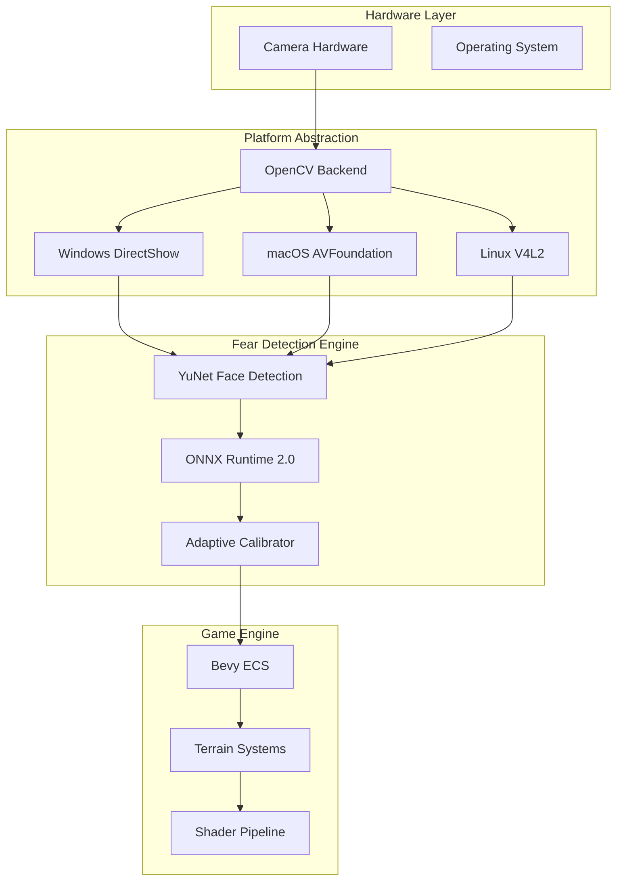
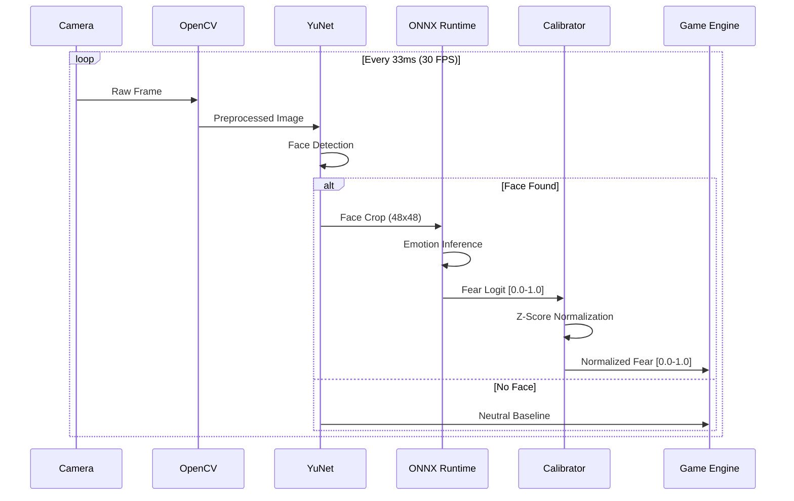
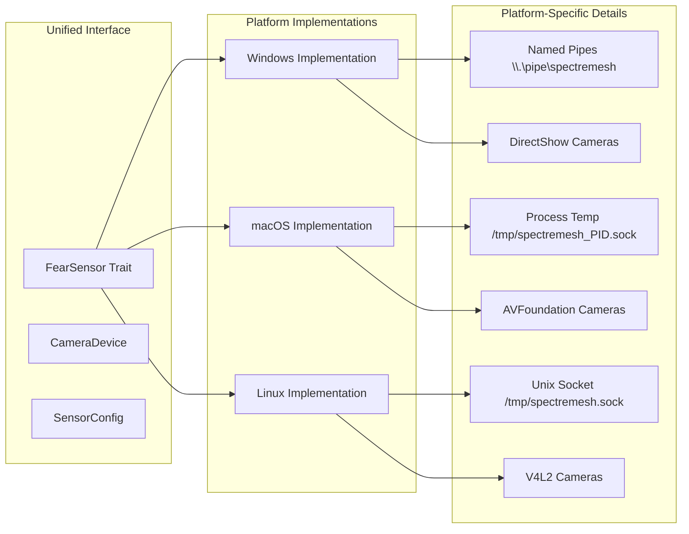
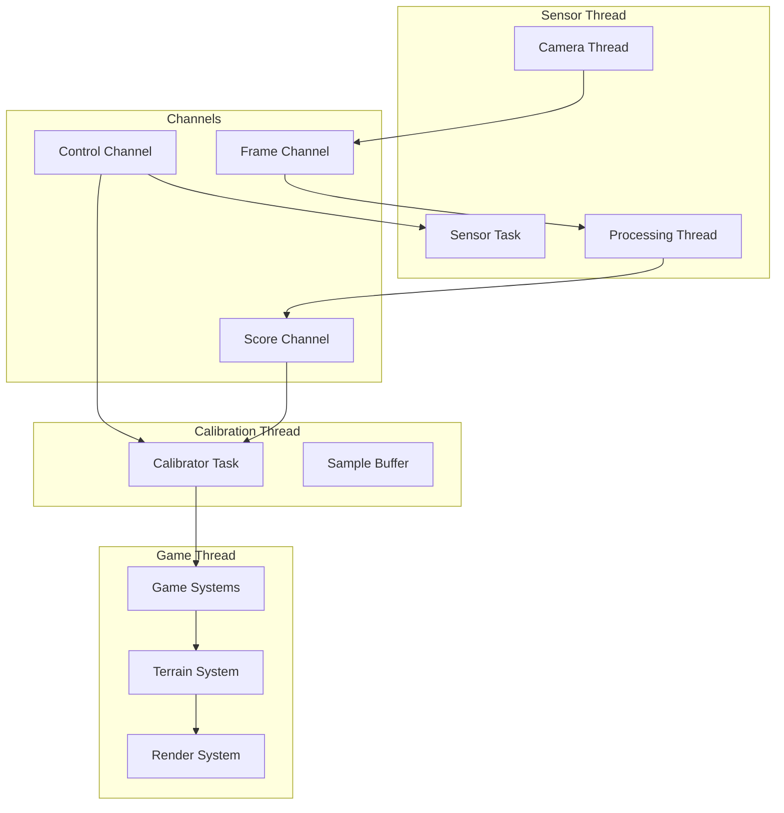
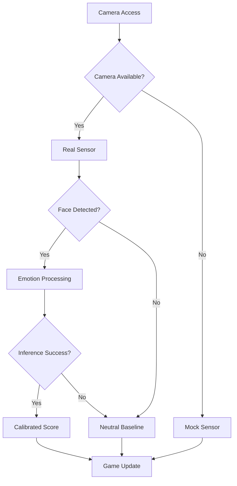

# SpectreMesh Technical Architecture

**Deep dive into the emotion-responsive procedural horror game system**

## Table of Contents

- [System Overview](#system-overview)
- [Fear Detection Pipeline](#fear-detection-pipeline)
- [Cross-Platform Architecture](#cross-platform-architecture)
- [Performance Characteristics](#performance-characteristics)
- [Data Flow](#data-flow)
- [Error Handling Strategy](#error-handling-strategy)
- [Security & Privacy](#security--privacy)

## System Overview

SpectreMesh employs a **modular, async-first architecture** designed for real-time emotion processing with cross-platform compatibility. The system follows a **risk-kill development strategy** where core technical risks were eliminated early through hardware validation.

### High-Level Architecture



### Core Design Principles

1. **Async-First**: All I/O operations use tokio for non-blocking processing
2. **Cross-Platform**: Platform-specific code isolated behind unified interfaces
3. **Graceful Degradation**: System continues operating when components fail
4. **Zero-Copy**: Minimize memory allocations in hot paths
5. **Embedded Models**: No external file dependencies for deployment

## Fear Detection Pipeline

### Pipeline Architecture



### Component Details

#### YuNet Face Detection
- **Model**: Multi-scale CNN (345KB embedded)
- **Input**: Variable resolution camera frames
- **Output**: Face bounding boxes with confidence scores
- **Performance**: 8-15ms on modern hardware
- **Robustness**: Handles multiple faces, selects largest/most confident

#### ONNX Runtime 2.0 Integration
- **Model**: 7-class emotion classifier
- **Input**: 48×48 grayscale face crops
- **Output**: `[angry, disgust, fear, happy, sad, surprise, neutral]`
- **Fear Extraction**: Uses `emotion_logits[2]` (fear probability)
- **Optimization**: CPU/GPU acceleration, quantization support

#### Adaptive Calibration System
```rust
// Exponential Moving Average for baseline establishment
pub struct AdaptiveCalibrator {
    mean: f32,
    variance: f32,
    alpha: f32,  // Learning rate (0.05 default)
    sample_count: usize,
}

impl AdaptiveCalibrator {
    pub fn normalize(&mut self, raw_fear: f32) -> f32 {
        // Update baseline with EMA
        self.mean = self.alpha * raw_fear + (1.0 - self.alpha) * self.mean;
        let diff = raw_fear - self.mean;
        self.variance = self.alpha * diff * diff + (1.0 - self.alpha) * self.variance;
        
        // Z-score normalization
        let std_dev = self.variance.sqrt().max(0.01); // Prevent division by zero
        let z_score = (raw_fear - self.mean) / std_dev;
        
        // Clamp to usable range
        z_score.max(0.0).min(1.0)
    }
}
```

## Cross-Platform Architecture

### Platform Abstraction Layer



### Camera Enumeration Strategy

```rust
// Platform-specific camera enumeration
async fn enumerate_cameras_opencv() -> Result<Vec<CameraDevice>, CameraError> {
    let mut cameras = Vec::new();
    
    // Try cameras 0-9 (reasonable range for most systems)
    for id in 0..10 {
        match VideoCapture::new(id, CAP_ANY) {
            Ok(mut camera) => {
                if camera.is_opened().unwrap_or(false) {
                    let name = get_platform_camera_name(id);
                    let resolution = get_camera_resolution(&camera);
                    cameras.push(CameraDevice::new(id as u32, name, resolution));
                    let _ = camera.release(); // Clean up
                }
            },
            Err(_) => continue, // Camera not available
        }
    }
    
    if cameras.is_empty() {
        Err(CameraError::NoCamerasAvailable)
    } else {
        Ok(cameras)
    }
}

fn get_platform_camera_name(id: i32) -> String {
    #[cfg(target_os = "windows")]
    return format!("DirectShow Camera {}", id);
    
    #[cfg(target_os = "macos")]
    return format!("AVFoundation Camera {}", id);
    
    #[cfg(target_os = "linux")]
    return format!("V4L2 Camera {}", id);
}
```

### Configuration Management

```rust
// Platform-specific socket paths
fn default_socket_path() -> String {
    #[cfg(target_os = "windows")]
    {
        r"\\.\pipe\spectre_sensor".to_string()  // Named pipes
    }
    #[cfg(target_os = "macos")]
    {
        format!("/tmp/spectre_sensor_{}.sock", std::process::id())  // Process-specific
    }
    #[cfg(target_os = "linux")]
    {
        "/tmp/spectre_sensor.sock".to_string()  // Standard temp path
    }
}
```

## Performance Characteristics

### Latency Breakdown

| Component | Typical Latency | Target | Notes |
|-----------|----------------|---------|-------|
| Camera Capture | 1-3ms | <5ms | Hardware dependent |
| YuNet Face Detection | 8-15ms | <20ms | Multi-scale CNN |
| Image Preprocessing | 1-2ms | <3ms | Resize, normalize |
| ONNX Emotion Inference | 3-8ms | <10ms | 7-class classifier |
| Calibration | 0.1ms | <1ms | Mathematical ops |
| **Total Pipeline** | **13-29ms** | **<40ms** | **Target: 30 FPS** |

### Memory Usage Profile

```
Startup Memory:
├── ONNX Runtime: ~50MB (model loading, graph optimization)
├── OpenCV: ~30MB (camera backends, image processing)
├── YuNet Model: ~10MB (embedded face detection)
├── Emotion Model: ~5MB (embedded emotion classifier)
└── Application: ~5MB (Rust runtime, async tasks)
Total: ~100MB baseline

Runtime Memory:
├── Frame Buffers: ~5MB (camera frames, face crops)
├── Inference Tensors: ~2MB (ONNX input/output)
├── Calibration History: ~1MB (sample buffers)
└── Async Channels: ~1MB (communication buffers)
Total: ~110MB during operation
```

### Throughput Characteristics

```
Target Performance:
├── Frame Rate: 30 FPS (33.33ms per frame)
├── Processing Rate: 25-30 FPS actual
├── Calibration Period: 30 seconds
└── Startup Time: <2 seconds cold start

Scaling Characteristics:
├── CPU Cores: Linear scaling up to 4 cores
├── GPU Acceleration: 2-3x speedup with CUDA/TensorRT
├── Memory Bandwidth: Not a bottleneck
└── Camera Resolution: Logarithmic impact (face detection)
```

## Data Flow

### Async Communication Architecture



### Message Types

```rust
// Core data structures
#[derive(Debug, Clone)]
pub struct FearFrame {
    pub fear_score: f32,        // Raw fear logit [0.0, 1.0]
    pub confidence: f32,        // Face detection confidence
    pub calibrated: bool,       // Whether score is calibrated
    pub timestamp: Instant,     // Frame timestamp
    pub face_detected: bool,    // Face presence flag
}

#[derive(Debug, Clone)]
pub struct FearScore {
    pub value: f32,             // Normalized fear [0.0, 1.0]
    pub bucket: FearBucket,     // Discrete fear level
    pub calibration_progress: f32, // Calibration completion [0.0, 1.0]
    pub metadata: FearMetadata, // Additional context
}

#[derive(Debug, Clone)]
pub enum FearBucket {
    Calm,       // [0.0, 0.2)
    Uneasy,     // [0.2, 0.4)
    Nervous,    // [0.4, 0.6)
    Scared,     // [0.6, 0.8)
    Terrified,  // [0.8, 1.0]
}
```

## Error Handling Strategy

### Error Taxonomy

```rust
#[derive(Debug, thiserror::Error)]
pub enum SensorError {
    #[error("Camera initialization failed: {0}")]
    CameraInit(String),
    
    #[error("Model loading failed: {0}")]
    ModelLoad(String),
    
    #[error("Inference failed: {0}")]
    Inference(String),
    
    #[error("No face detected in frame")]
    NoFaceDetected,
    
    #[error("Calibration incomplete: {progress}% complete")]
    CalibrationIncomplete { progress: f32 },
    
    #[error("Platform not supported: {platform}")]
    UnsupportedPlatform { platform: String },
}
```

### Graceful Degradation



### Recovery Strategies

1. **Camera Failure**: Automatic fallback to mock sensor
2. **Face Detection Failure**: Use neutral emotion baseline
3. **Model Loading Failure**: Clear error messages with setup guidance
4. **Inference Timeout**: Skip frame and continue processing
5. **Calibration Incomplete**: Provide uncalibrated scores with warnings

## Security & Privacy

### Privacy-First Design

- **Local Processing**: All emotion analysis happens on-device
- **No Data Transmission**: Camera data never leaves the local machine
- **No Persistent Storage**: Frames are processed and immediately discarded
- **Minimal Data Retention**: Only statistical calibration data kept in memory

### Security Considerations

- **Camera Permissions**: Platform-specific permission handling
- **Model Integrity**: Embedded models prevent tampering
- **Memory Safety**: Rust's ownership system prevents buffer overflows
- **Input Validation**: All external inputs validated and sanitized

This architecture enables SpectreMesh to deliver real-time, personalized horror experiences while maintaining user privacy and system reliability across all supported platforms.
